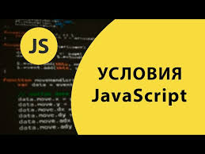
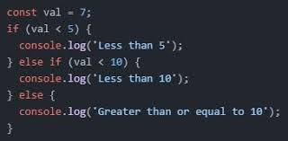
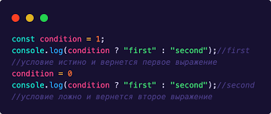
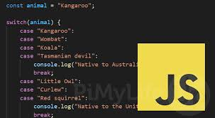
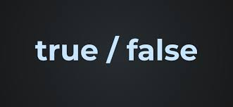
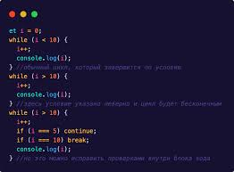
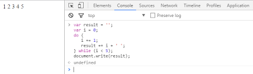
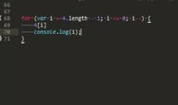
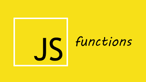
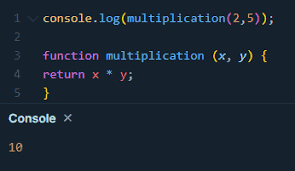

# Условное ветвление: if, '?'

Иногда нам нужно выполнить различные действия в зависимости от условий.

Для этого мы можем использовать инструкцию if и условный оператор ?, который также называют оператором «вопросительный знак».

Инструкция «if»
Инструкция if(...) вычисляет условие в скобках и, если результат true, то выполняет блок кода.

Например:

### Блок "else"

Инструкция if может содержать необязательный блок «else» («иначе»). Он выполняется, когда условие ложно.

Например:

# Условный оператор

Иногда нам нужно определить переменную в зависимости от условия.

Так называемый «условный» оператор «вопросительный знак» позволяет нам сделать это более коротким и простым способом.

Оператор представлен знаком вопроса ?. Его также называют «тернарный», так как этот оператор, единственный в своём роде, имеет три аргумента.

Синтаксис:

Сначала вычисляется условие: если оно истинно, тогда возвращается значение1, в противном случае – значение2.

## Конструкция "switch"

Конструкция switch заменяет собой сразу несколько if.

Она представляет собой более наглядный способ сравнить выражение сразу с несколькими вариантами.

### Синтаксис
Конструкция switch имеет один или более блок case и необязательный блок default.

Выглядит она так:

# Преобразование к логическому типу

Инструкция if (…) вычисляет выражение в скобках и преобразует результат к логическому типу.

Давайте вспомним правила преобразования типов из главы Преобразование типов:

Число 0, пустая строка "", null, undefined и NaN становятся false. Из-за этого их называют «ложными» («falsy») значениями.
Остальные значения становятся true, поэтому их называют «правдивыми» («truthy»).
Таким образом, код при таком условии никогда не выполнится:

# Циклы while и for

При написании скриптов зачастую встаёт задача сделать однотипное действие много раз.

Например, вывести товары из списка один за другим. Или просто перебрать все числа от 1 до 10 и для каждого выполнить одинаковый код.

Для многократного повторения одного участка кода предусмотрены циклы.

## Цикл "while"

Цикл while имеет следующий синтаксис:

* while (condition) {

  // код
  // также называемый "телом цикла"

}

Код из тела цикла выполняется, пока условие condition истинно.

Например, цикл ниже выводит i, пока i < 3:

Одно выполнение тела цикла по-научному называется итерация. Цикл в примере выше совершает три итерации.

Если бы строка i++ отсутствовала в примере выше, то цикл бы повторялся (в теории) вечно. На практике, конечно, браузер не позволит такому случиться, он предоставит пользователю возможность остановить «подвисший» скрипт, а JavaScript на стороне сервера придётся «убить» процесс.

Например, while (i) – более краткий вариант while (i != 0):

## Цикл "do while"

Проверку условия можно разместить под телом цикла, используя специальный синтаксис do..while:

Цикл сначала выполнит тело, а затем проверит условие condition, и пока его значение равно true, он будет выполняться снова и снова.

Такая форма синтаксиса оправдана, если вы хотите, чтобы тело цикла выполнилось хотя бы один раз, даже если условие окажется ложным. На практике чаще используется форма с предусловием: while(…) {…}.

## Цикл "for"

Более сложный, но при этом самый распространённый цикл — цикл for.

В целом, алгоритм работы цикла выглядит следующим образом:

* Выполнить начало
→ (Если условие == true → Выполнить тело, Выполнить шаг)
→ (Если условие == true → Выполнить тело, Выполнить шаг)
→ (Если условие == true → Выполнить тело, Выполнить шаг)
→ ...

То есть, начало выполняется один раз, а затем каждая итерация заключается в проверке условия, после которой выполняется тело и шаг.

Если тема циклов для вас нова, может быть полезным вернуться к примеру выше и воспроизвести его работу на листе бумаги, шаг за шагом.

Вот в точности то, что происходит в нашем случае:

# Функции

Зачастую нам надо повторять одно и то же действие во многих частях программы.

Например, необходимо красиво вывести сообщение при приветствии посетителя, при выходе посетителя с сайта, ещё где-нибудь.

Чтобы не повторять один и тот же код во многих местах, придуманы функции. Функции являются основными «строительными блоками» программы.

Примеры встроенных функций вы уже видели – это alert(message), prompt(message, default) и confirm(question). Но можно создавать и свои.

## Объявления функции

Для создания функций мы можем использовать объявление функции.

Пример объявления функции:

* Вначале идёт ключевое слово function, после него имя функции, затем список параметров в круглых скобках через запятую (в вышеприведённом примере он пустой) и, наконец, код функции, также называемый «телом функции», внутри фигурных скобок.

## Локальные переменные

Переменные, объявленные внутри функции, видны только внутри этой функции.

